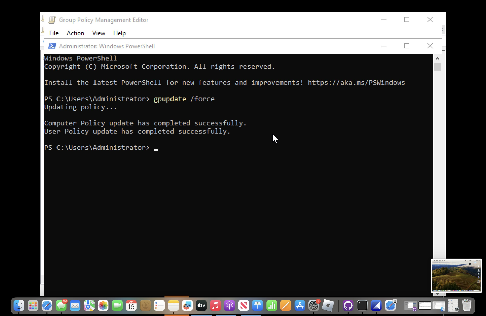

# Windows Server 2022 Active Directory Lab
 
This project sets up a full Active Directory environment on Windows Server 2022 using UTM on macOS. It's designed to simulate enterprise IT infrastructure with user provisioning, Group Policy management, and domain controller setup — all running on a local VM.

## Technologies Used

- **UTM** on macOS for virtualization
- **Windows Server 2022 Standard Evaluation**
- **Active Directory Domain Services (AD DS)**
- **Group Policy Management**
- **PowerShell** scripting

##  What I Built

- Installed and configured Windows Server 2022 via UTM
- Promoted the server to a Domain Controller
- Set up Active Directory (`lab.local`)
- Created and bulk-added 50+ users using PowerShell
- Implemented Group Policy Objects (GPOs)
- Configured user login permissions
- Simulated enterprise environment (OU structure, domain logins, drive mappings, etc.)

##  Screenshots

#### PowerShell User Script

#### Finance Department Users

#### IT Department Users

#### HR Department Users

#### Group Policy Objects (GPOs)

##  How to Use

1. Clone this repo
2. Launch UTM
3. Follow instructions in `setup.md` (if provided)
4. Use the PowerShell scripts in `/scripts` to automate user provisioning and AD setup

##  Skills Demonstrated

- Windows Server Administration
- Active Directory Configuration
- GPO Management
- PowerShell Automation
- Virtualization on macOS
